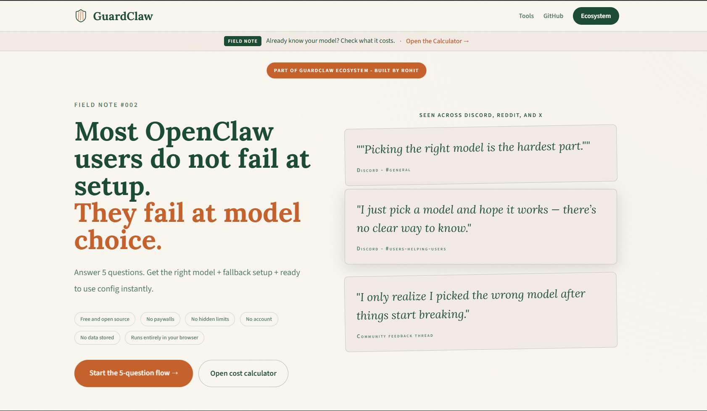

# OpenClaw Model Picker

## 1. Hero Section

**Pick the right model before you spend a week debugging the wrong one.**

A free, open-source decision tool for OpenClaw users who want a primary model, a fallback model, and a realistic cost estimate without guessing. It asks a few simple questions, then returns a recommendation you can actually ship with.

🔗 **[Try it live → guardclaw.dev/picker](https://guardclaw.dev/picker)**



---

## 2. Why This Exists

Every community has the same version of this problem. The same question shows up in Discord, Reddit, and side conversations after every model release: what should I actually use?

Someone links a benchmark. Someone else says "just use the strongest one you can afford." By the end of the thread, nobody is more confident than they were at the start.

That guesswork becomes expensive fast. It shows up as blown budgets, tool-call failures, weak outputs, and setups that only look good until the first real task lands.

This tool exists to cut through that noise. It gives people a practical starting point based on use case, budget, and billing mode, then adds a fallback so the setup is still usable when the first choice is not available.

---

## 3. What It Does

The picker recommends a **primary model** and a **fallback model** for your OpenClaw setup. It is designed to help you move from "I think this model will work" to "this is the stack I’m going to try first."

The flow is simple: **use case → budget → billing mode**. In the current app, the picker also checks whether you care about tool calls and whether you are comfortable using a local model, because those answers change the safest recommendation path.

What you get back is practical, not abstract:

- A primary model recommendation
- A fallback model for resilience
- An estimated monthly cost range
- A paste-ready config snippet


---

## 4. Supported Platforms/Models

The picker covers the providers most OpenClaw users end up comparing in practice, including cloud, gateway, and local paths.

| Provider | What it covers | Notes |
|---|---|---|
| Anthropic | Claude Opus, Sonnet, and Haiku families | Strong choice when reliability and reasoning quality matter |
| OpenAI | GPT-4o, GPT-4.1, GPT-5.2 | Useful for general-purpose and coding-heavy workflows |
| OpenAI Codex OAuth | GPT-5.3 Codex | OAuth-backed Codex flow for supported setups |
| Google | Gemini 2.5 Pro and Flash | Good for long-context and budget-sensitive use cases |
| Moonshot | Kimi K2.5 | Common budget-friendly recommendation in the picker |
| MiniMax | M2.5 | Lower-cost fallback and backup path |
| Qwen Portal | Coder model | Free-tier-friendly hosted option |
| OpenRouter | Gateway routing layer | Used as a gateway to reach supported models through one route |
| Ollama | Local model path | Best when you want a zero-API-cost local option |
| vLLM-style deployments | Local inference path | Fits the same zero-API-cost pattern if you extend the local branch |

Free-tier models are handled separately, because they behave more like rate-limited routes than normal paid APIs. The picker will prefer the safest free path it can verify, then fall back to another free route when needed.

Local models are supported too. If you can run Ollama comfortably, the picker can recommend a zero-dollar path and keep the cloud fallback ready when local hardware is not enough. vLLM-style deployments fit the same self-hosted pattern if you wire them into the same local branch.

---

## 5. How It Works (Decision Tree Overview)

The picker uses a decision tree instead of a hard-coded "best model" answer. That matters because the right recommendation changes when your budget changes, your billing style changes, or your task needs tool reliability.

The app asks:

- What’s your primary use case? (`coding`, `chat`, `analysis`, and related workflows)
- What’s your budget? (`free`, `$0-20`, `$20-50`, `$50+`)
- Subscription or API billing?

In the live UI, the flow also checks whether you need reliable tool calls and whether you are open to a local model. Those two answers help narrow down when a free, local, or gateway-backed option is actually realistic.

The output logic is straightforward:

- Match the model to the use case first
- Narrow the choice by budget
- Adjust the recommendation for subscription or API billing
- Prefer a fallback that stays useful if the primary route breaks

The fallback logic is there for resilience, not decoration. If the primary model is too expensive, rate-limited, or overkill for the next task, the picker gives you a second model that keeps the workflow moving.

Cost blending is shown as part of the recommendation so you can see the impact of using the stack, not just the headline model. That makes it easier to compare a "cheap primary with strong fallback" against a "premium primary with a cheaper safety net."

---

## 6. Running Locally

```bash
git clone https://github.com/RohitKS7/model_picker
cd model_picker
npm install
npm run dev
```

Open [http://localhost:3000](http://localhost:3000) in your browser.

If you want to check the picker route directly, open [http://localhost:3000/pick](http://localhost:3000/pick).

---

## 7. How to Update the Decision Tree

The recommendation logic is kept in data, not scattered across UI code.

Current files to know:

- `src/data/decisionTree.ts` for the recommendation branches
- `src/data/models.ts` for model metadata and display names
- `src/types/picker.ts` for the input and output shapes

If you want a dedicated data file later, `src/data/modelRecommendations.ts` would be a natural home. Today, the live branching logic already behaves like a data table inside `src/data/decisionTree.ts`.

An entry can be represented like this:

```ts
{
  useCases: ["coding", "analysis"],
  budgetTiers: ["0-20", "20-50"],
  billingModes: ["api", "subscription"],
  recommendedModel: "claude-sonnet-4-6",
  fallbackModel: "claude-haiku-4-5",
  reasonWhy: "Sonnet is balanced for coding tasks, while Haiku stays cheaper as a fallback."
}
```

In the current codebase, the same idea is stored as a keyed rule in `src/data/decisionTree.ts`, for example:

```ts
const RULE_TABLE: Record<string, RuleConfig> = {
  "coding:subscription:20to40:tool": {
    primaryId: "anthropic/claude-sonnet-4-6",
    primaryReason: "Best tool call reliability at the $20 subscription tier.",
    fallbackId: "anthropic/claude-haiku-4-5",
    fallbackReason: "Lower-cost backup that keeps behavior predictable.",
    fallbackTrigger: "Falls back when primary model is overkill for the next turn."
  }
}
```

To add a new recommendation:

1. Add the model metadata in `src/data/models.ts` if the model is new to the picker.
2. Add or update the rule branch in `src/data/decisionTree.ts`.
3. Make sure the `primaryId` and `fallbackId` both exist in `src/data/models.ts`.
4. Test the affected path in `/pick` with a few realistic inputs.
5. Verify the generated config snippet still makes sense for the chosen models.

To adjust an existing recommendation:

1. Start with community feedback from Discord, Reddit, or issue reports.
2. Check whether the complaint is about capability, price, tool calls, or local hardware.
3. Update the rule only as far as the evidence supports.
4. Leave the reason strings honest and specific.
5. If the change is opinionated, call it out in the changelog or PR description.

The most useful updates usually come from people who have actually used the model stack in real projects. Community model feedback is the most valuable contribution here because it keeps the decision tree grounded in experience, not just specs.

---

## 8. Tech Stack

- **Framework:** Next.js with App Router
- **Styling:** Tailwind CSS + GuardClaw design system
- **Animations:** Framer Motion
- **Data:** Static decision tree, no backend
- **Deployment:** Vercel
- **Backend:** None

The app stays intentionally lightweight so the recommendation logic is easy to inspect, easy to update, and easy to trust.

---

## 9. Part of GuardClaw Ecosystem

This is **Field Note #002** in the GuardClaw ecosystem.

🌐 **[Visit GuardClaw](https://guardclaw.dev)**

Use the Model Picker to choose a stack, then verify the actual spend in the Token Cost Calculator:

- 🔗 **[Token Cost Calculator](https://guardclaw.dev/calculator)** - confirm what the chosen stack costs
- 🔗 **[Model Picker](https://guardclaw.dev/picker)** - this tool
- 🔗 **[All GuardClaw tools](https://guardclaw.dev/tools)** - the broader ecosystem

Follow along:

- **[@SumanRohitK7](https://twitter.com/SumanRohitK7)**

---

## 10. Contributing

Contributions are welcome, especially when they improve the decision tree itself.

Things that help most:

- Recommendation improvements based on real community usage
- Better handling of edge cases in budget or billing mode
- Bug reports that make the picker more trustworthy
- UX suggestions that make the flow easier to understand

See [CONTRIBUTING.md](./CONTRIBUTING.md) for the workflow and project conventions.

If you only have time for one kind of contribution, community model feedback is the most valuable. Real-world reports about what worked, what failed, and what felt misleading are what keep the picker honest.

---

## 11. Support

If this tool helps you pick a better stack, a star goes a long way.

⭐ **[Star this repo](https://github.com/RohitKS7/model_picker)**

💖 **[Sponsor Rohit on GitHub](https://github.com/sponsors/RohitKS7)**

After picking a model, verify costs in the Token Cost Calculator:

🔗 **[Open the Token Cost Calculator](https://guardclaw.dev/calculator)**

---

## 12. Footer

Built in public by Rohit Kumar.

Free forever. Open source.
